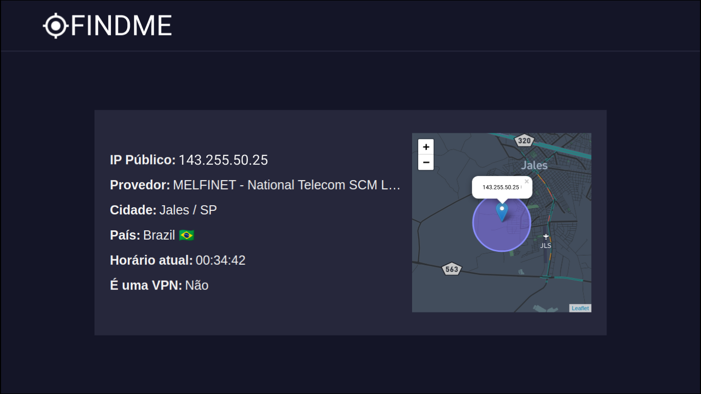

<h1 align='center'>
  
</h1>

## 💻 Como acessar o projeto

### Para ver a aplicação acesse: [Find Me](https://findmenow.netlify.app/)

<h1></h1>

<h1>
  
</h1>

## 📃 Sobre

O projeto **FIND ME** é uma aplicação simples para mostrar os dados de conexão do usuário, assim como sua **possível** localização com um raio de 1000 metros de margem de erro, já que não foi utilizada a API de geolocalização do navegador que necessita de autorização por parte do usuário para a obtenção dos dados.

A aplicação tem como objetivo nos fazer refletir sobre a quantidade de informações que são possíveis de serem obtídas sem o consentimento do usuário, utilizando apenas seu endereço de ip público.

## 🚀 Tecnologias utilizadas

O projeto foi desenvolvido utilizando as seguintes tecnologias:

- [HTML](https://developer.mozilla.org/pt-BR/docs/Web/HTML)
- [CSS](https://developer.mozilla.org/pt-BR/docs/Web/CSS)
- [Javascript](https://developer.mozilla.org/pt-BR/docs/Web/JavaScript)
- [Leaflet](https://leafletjs.com/) : Biblioteca JavaScript de código aberto
  para mapas interativos (alternativa para o google maps).
- [IP2Location](https://www.ip2location.com/) Serviço que identifica a localização geográfica e proxy por endereço IP.

</p>

## 📥 Como baixar o projeto

```bash
    $ git clone https://github.com/eliezer537/Find-Me.git
    $ cd FindMe
```

Para visualizar o projeto em seu computador basta ter um servidor local de desenvolvimento como o **Live Server**.
Caso não tenha um instalado você poderá acessar o [Guia de instalação](https://marketplace.visualstudio.com/items?itemName=ritwickdey.LiveServer).


